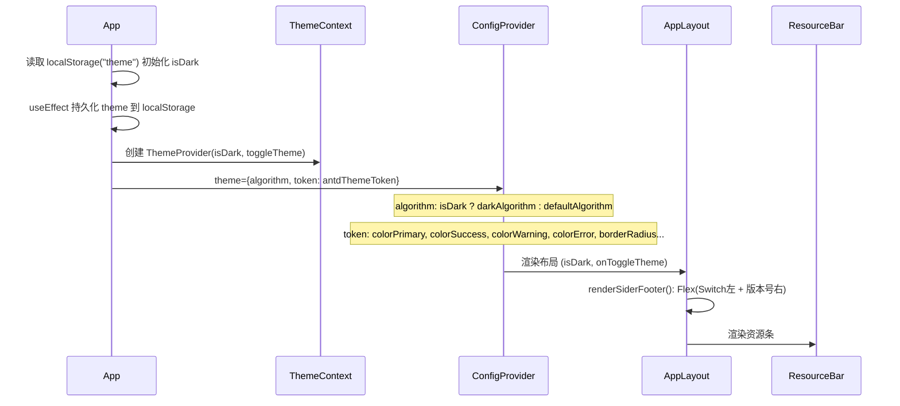
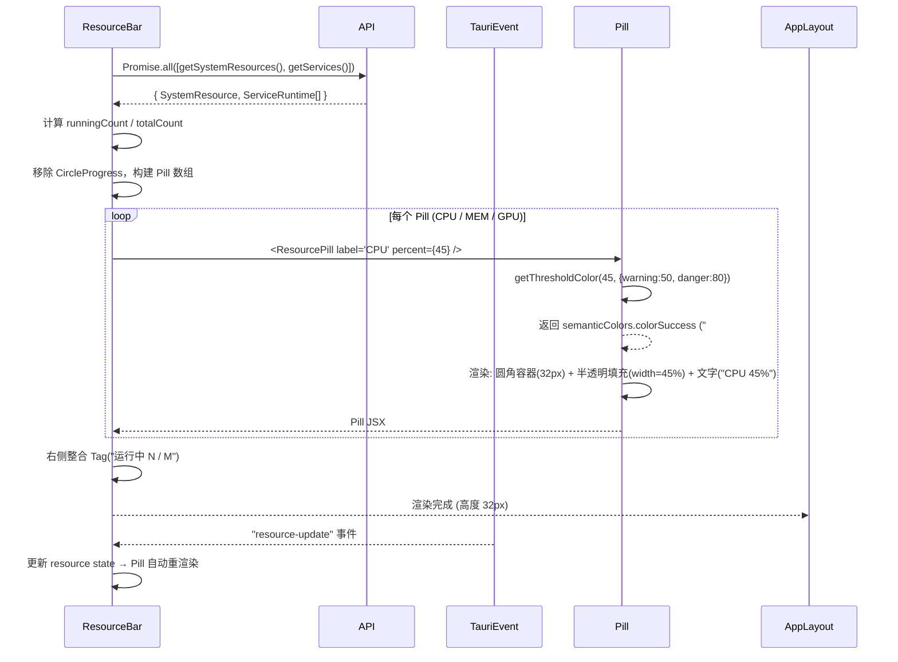
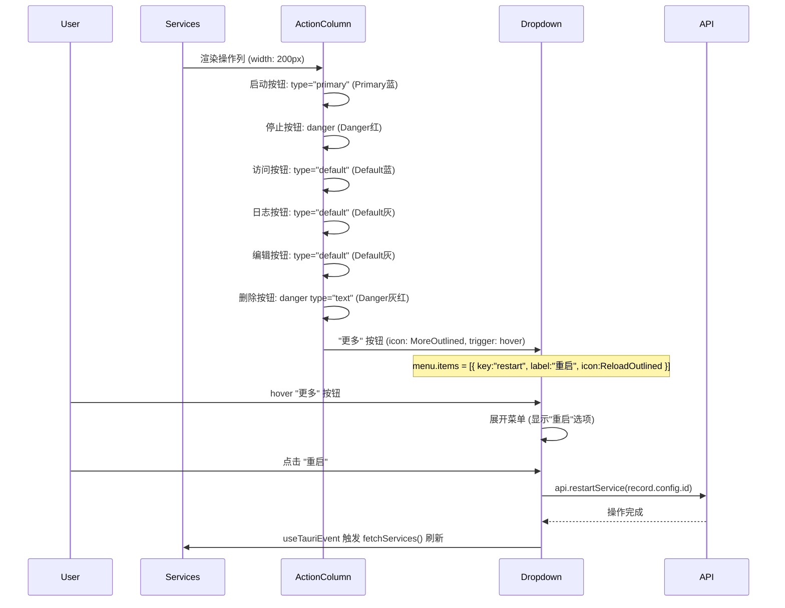
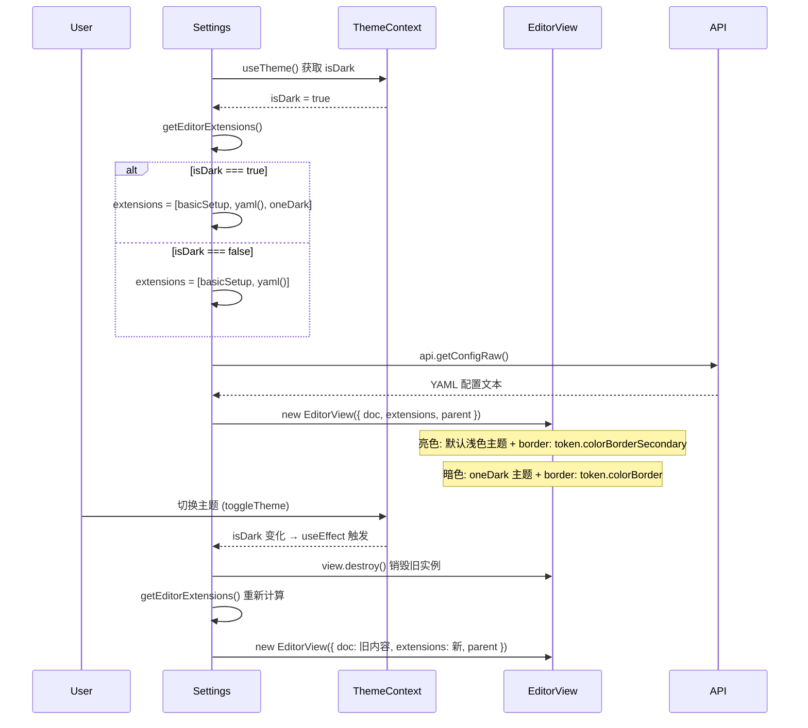
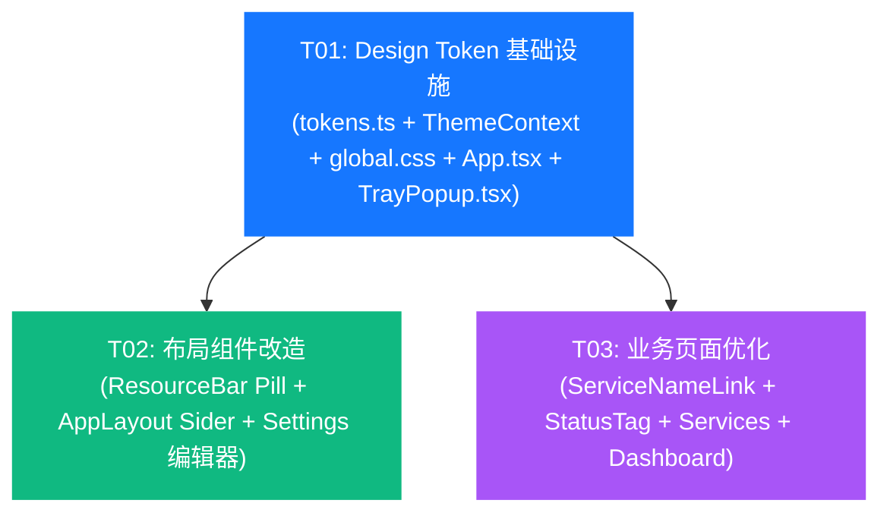

# ServicePilot UI 优化增量 — 系统设计文档

> 项目：ServicePilot（本地服务管理平台）
> 技术栈：Tauri v2 + React 18 + Ant Design v5.29.3 + TypeScript
> 范围：第一批次 P0+P1 共 9 项 UI 优化，不改变现有功能逻辑

---

## Part A: 系统设计

### 1. 实现方案与框架选型

#### 1.1 核心技术挑战

| 挑战 | 说明 |
|------|------|
| Design Token 统一管理 | 当前项目有大量 inline 硬编码颜色（`#ff4d4f`、`#52c41a`、`#faad14` 等），散布在 7+ 文件中，需要统一为语义化 Token 体系 |
| ResourceBar Pill 改造 | 从 Ant Design `Progress type="circle"` 改为横向 Pill 样式，需自绘进度条且保持阈值配色 |
| 异常行视觉强化 | 需在 Table 行级别添加左侧色条 + 背景色 + Tag pulse 动画，跨 Services 和 Dashboard 两个页面 |
| CodeMirror 主题跟随 | CodeMirror 6 的 `oneDark` 扩展在初始化时绑定，主题切换需动态重新配置 extensions |
| 操作列紧凑化 | 从 280px 缩减至 ≤200px，需将重启按钮收入 Dropdown 并按语义着色 |
| Dashboard 卡片等高 | 4 列卡片高度不一致，需 CSS flexbox 方案统一 |

#### 1.2 框架与库选型

| 组件 | 选型 | 理由 |
|------|------|------|
| UI 组件库 | **Ant Design v5.29.3**（已有） | 使用 v5 Token API + ConfigProvider，无需额外 UI 框架 |
| Token 注册 | **ConfigProvider token + CSS 变量** | PRD 已确认不使用 Tailwind；通过 `theme.token` 注册到 Ant Design 组件，通过 CSS 变量供自定义组件使用 |
| Pill 进度条 | **CSS 自绘**（非 Ant Design Progress） | Ant Progress line 默认 padding/高度过大，无法实现 32px 紧凑 Pill；CSS 方案精确控制布局 |
| 重启按钮收纳 | **Dropdown trigger="hover"** | Ant Design Dropdown 原生支持 hover 触发，比 Popover 更适合动作菜单场景 |
| 异常行动画 | **CSS @keyframes**（global.css） | 纯 CSS 实现 pulse 动画，无 JS 开销，通过 className 控制启用 |
| CodeMirror 主题 | **条件 extension + EditorView 重建** | 亮色模式移除 `oneDark` 扩展使用默认浅色主题；暗色模式保留 `oneDark`；主题切换时重建 EditorView |
| 主题状态共享 | **React Context（ThemeContext）** | 当前 `isDark` 仅在 App→AppLayout 传递，Settings/Dashboard 等页面无法获取；创建轻量 Context 提供 `isDark` |

#### 1.3 架构模式

- **Component-Based**（保持现有）：页面组件 + 布局组件 + 共享业务组件
- **Token-Driven Theming**：所有颜色/字号/间距/圆角/阴影通过 Token 引用，禁止 inline 硬编码
- **Context for Theme State**：ThemeContext 提供 `isDark` 给任意层级的消费者

---

### 2. 文件列表

#### 新建文件

| 文件路径 | 说明 |
|---------|------|
| `src/styles/tokens.ts` | Design Token 定义：语义色、字号、间距、圆角、阴影、阈值配色函数、antdThemeToken、CSS 变量映射 |
| `src/contexts/ThemeContext.tsx` | 主题上下文：提供 `isDark` 和 `toggleTheme`，供 Settings 等页面消费 |
| `src/components/common/ServiceNameLink.tsx` | 服务名称链接组件：Typography.Link + Tooltip「点击查看日志」+ hover 下划线 |
| `src/components/common/StatusTag.tsx` | 状态标签组件：封装 statusMap + 异常状态 pulse 动画，Services/Dashboard/TrayPopup 复用 |

#### 修改文件

| 文件路径 | 修改内容 |
|---------|---------|
| `src/App.tsx` | 注册完整 antdThemeToken 到 ConfigProvider；包裹 ThemeContext.Provider；托盘弹窗也注册 Token |
| `src/styles/global.css` | 注册 CSS 变量；强化异常行样式（左侧色条 + 背景色）；新增 `.tag-error-pulse` 动画；scrollbar 颜色适配 |
| `src/components/layout/ResourceBar.tsx` | CircleProgress → 自绘 Pill；整合「运行 N/M」Tag 到右侧；硬编码颜色替换为 Token |
| `src/components/layout/AppLayout.tsx` | Sider 底部 Flex 重排（Switch 左 + 版本号右 + 分割线 + 48px 高度）；硬编码颜色替换为 Token |
| `src/pages/Settings.tsx` | CodeMirror 主题跟随 isDark；编辑器容器 border 颜色随主题变化 |
| `src/pages/Services.tsx` | 操作列图标按钮语义着色；重启按钮移入 Dropdown；列宽缩减至 ≤200px；工具栏双层分层；异常行集成 StatusTag；名称列集成 ServiceNameLink |
| `src/pages/Dashboard.tsx` | 卡片等高对齐（flexbox）；第 4 列改为单卡片 3 行 Statistic；异常行集成 StatusTag；名称列集成 ServiceNameLink |
| `src/pages/TrayPopup.tsx` | 硬编码颜色替换为 Token；状态标签替换为 StatusTag 组件 |

---

### 3. 数据结构与接口

```mermaid
classDiagram
    class DesignTokens {
        <<module src/styles/tokens.ts>>
        +semanticColors: SemanticColors
        +fontSizes: FontSizeScale
        +spacing: SpacingScale
        +borderRadius: RadiusScale
        +shadows: ShadowScale
        +antdThemeToken: ThemeConfig
        +cssVariables: Record~string,string~
        +getThresholdColor(percent: number, thresholds?: ThresholdConfig) string
    }

    class SemanticColors {
        +colorPrimary: string = '#1677ff'
        +colorSuccess: string = '#10b981'
        +colorWarning: string = '#f59e0b'
        +colorError: string = '#ef4444'
        +colorAccent: string = '#a855f7'
    }

    class FontSizeScale {
        +XS: FontSize = {size: 11, weight: 400}
        +SM: FontSize = {size: 12, weight: 400}
        +Base: FontSize = {size: 14, weight: 400}
        +MD: FontSize = {size: 16, weight: 500}
        +LG: FontSize = {size: 20, weight: 600}
        +XL: FontSize = {size: 28, weight: 700}
    }

    class ThemeContextValue {
        +isDark: boolean
        +toggleTheme: () => void
    }

    class ResourcePillProps {
        +label: string
        +percent: number
        +thresholds?: ThresholdConfig
        +extra?: string
    }

    class ServiceNameLinkProps {
        +name: string
        +serviceId: string
        +onClick: (serviceId: string) => void
    }

    class StatusTagProps {
        +status: ServiceStatus
        +pulse?: boolean
        +size?: 'small' | 'default'
    }

    class ResourceBar {
        -resource: SystemResource
        -runningCount: number
        -totalCount: number
        +fetchResources() Promise~void~
        +renderPill(label, percent, thresholds) JSX
    }

    class AppLayout {
        +isDark: boolean
        +onToggleTheme: () => void
        -renderSiderFooter() JSX
    }

    class Services {
        -services: ServiceRuntime[]
        -filteredServices: ServiceRuntime[]
        -columns: ColumnDef[]
        -renderToolbar() JSX
        -renderActionColumn(record) JSX
        -renderMoreDropdown(record) JSX
    }

    class Dashboard {
        -services: ServiceRuntime[]
        -resource: SystemResource
        -columns: ColumnDef[]
        -renderStatCards() JSX
    }

    class Settings {
        -isDark: boolean
        -editorView: EditorView
        -getEditorExtensions() Extension[]
        +loadConfig() Promise~void~
        +handleSave() Promise~void~
    }

    DesignTokens --> SemanticColors
    DesignTokens --> FontSizeScale
    DesignTokens ..> ResourceBar : getThresholdColor()
    ResourcePillProps ..> ResourceBar : props
    ServiceNameLinkProps ..> Services : props
    ServiceNameLinkProps ..> Dashboard : props
    StatusTagProps ..> Services : props
    StatusTagProps ..> Dashboard : props
    StatusTagProps ..> TrayPopup : props
    ThemeContextValue ..> Settings : isDark
    ThemeContextValue ..> AppLayout : isDark
```

#### 关键类型定义

```typescript
// === src/styles/tokens.ts ===

interface FontSize {
  size: number;
  weight: number;
}

interface ThresholdConfig {
  warning: number;  // default 50
  danger: number;   // default 80
}

type ThresholdLevel = 'success' | 'warning' | 'danger';

// === src/contexts/ThemeContext.tsx ===

interface ThemeContextValue {
  isDark: boolean;
  toggleTheme: () => void;
}

// === src/components/common/ResourcePill.tsx (内联于 ResourceBar) ===

interface ResourcePillProps {
  label: string;           // "CPU" | "MEM" | "GPU"
  percent: number;         // 0-100
  thresholds?: ThresholdConfig;
  extra?: string;          // 附加文本，如 "8.2 / 16 GB"
}

// === src/components/common/ServiceNameLink.tsx ===

interface ServiceNameLinkProps {
  name: string;
  serviceId: string;
  onClick: (serviceId: string) => void;
}

// === src/components/common/StatusTag.tsx ===

interface StatusTagProps {
  status: ServiceStatus;
  pulse?: boolean;         // 异常状态是否启用 pulse 动画，默认 true
  size?: 'small' | 'default';
}
```

---

### 4. 程序调用流程

#### 4.1 应用初始化 + Token 注册流程



#### 4.2 ResourceBar Pill 渲染流程



#### 4.3 Services 操作列渲染流程（含 Dropdown 重启）



#### 4.4 Settings 编辑器主题切换流程



---

### 5. 待明确事项

| # | 问题 | 当前假设 |
|---|------|---------|
| 1 | ResourcePill 是否需要独立为 `src/components/common/ResourcePill.tsx` 组件 | **假设**：Pill 仅在 ResourceBar 中使用，作为内部渲染函数实现，不独立为公共组件。如后续 TrayPopup 也需 Pill，再抽取 |
| 2 | CodeMirror 亮色主题是否需要自定义语法高亮配色 | **假设**：使用 CodeMirror 6 默认浅色主题（`basicSetup` 自带），不做额外自定义。如需更精细控制可后续引入 `@codemirror/view` 的 `EditorView.theme()` |
| 3 | Dashboard 第 4 列单卡片内 3 行 Statistic 是否需要分隔线 | **假设**：使用 `Divider` 或 `marginBottom` 分隔，视觉上与左侧卡片 Statistic 一致 |
| 4 | TrayPopup 窗口是否也需要跟随暗色主题 | **假设**：当前 TrayPopup 固定使用 `defaultAlgorithm`（亮色），本次仅替换硬编码颜色为 Token，不改变其固定亮色策略 |
| 5 | 异常行高亮的 `!important` 优先级是否会影响 Ant Design Table hover 效果 | **假设**：使用 `!important` 确保异常行背景色生效，hover 时 Ant Design 自身 hover 背景色通过 `:hover` 覆盖 |

---

## Part B: 任务分解

### 6. 依赖包列表

| 包名 | 版本 | 用途 | 状态 |
|------|------|------|------|
| `antd` | ^5.29.3 | UI 组件库 + ConfigProvider Token 系统 | **已有** |
| `@ant-design/icons` | ^5.6.1 | 图标（MoreOutlined 等） | **已有** |
| `codemirror` | ^6.0.2 | 代码编辑器核心 | **已有** |
| `@codemirror/theme-one-dark` | ^6.1.3 | CodeMirror 暗色主题 | **已有** |
| `@codemirror/lang-yaml` | ^6.1.3 | YAML 语法支持 | **已有** |
| `@codemirror/view` | ^6.43.6 | CodeMirror 视图层 | **已有** |
| `@codemirror/state` | ^6.7.1 | CodeMirror 状态管理 | **已有** |

> **结论：无需新增任何 npm 包**。所有优化均基于现有依赖实现。

---

### 7. 任务列表

#### T01: Design Token 体系 + 全局样式 + ThemeContext + TrayPopup 适配

| 属性 | 值 |
|------|-----|
| **任务名** | 建立 Design Token 基础设施、全局样式、主题上下文 |
| **优先级** | P0 |
| **依赖** | 无 |
| **覆盖 PRD** | #009（Design Token）、#003-partial（全局异常行 CSS）、TrayPopup Token 适配 |

**源文件：**

| 操作 | 文件 |
|------|------|
| 新建 | `src/styles/tokens.ts` |
| 新建 | `src/contexts/ThemeContext.tsx` |
| 修改 | `src/App.tsx` |
| 修改 | `src/styles/global.css` |
| 修改 | `src/pages/TrayPopup.tsx` |

**实现要点：**

1. **`src/styles/tokens.ts`（新建）**
   - 定义 `semanticColors`：colorPrimary `#1677ff`、colorSuccess `#10b981`、colorWarning `#f59e0b`、colorError `#ef4444`、colorAccent `#a855f7`
   - 定义 `fontSizes`：6 阶（XS 11/400、SM 12/400、Base 14/400、MD 16/500、LG 20/600、XL 28/700）
   - 定义 `spacing`：4/8/12/16/24/32
   - 定义 `borderRadius`：tag=4、input=6、card=10、button=8、pill=999
   - 定义 `shadows`：sm/md/lg
   - 定义 `getThresholdColor(percent, thresholds?)` 函数：>80% 返回 colorError、>50% 返回 colorWarning、其余返回 colorSuccess
   - 定义 `antdThemeToken`：传入 ConfigProvider 的 token 对象
   - 定义 `cssVariables`：CSS 变量名→值的映射，供 global.css `:root` 注册

2. **`src/contexts/ThemeContext.tsx`（新建）**
   - `ThemeContext = createContext<ThemeContextValue>`
   - `ThemeProvider({ isDark, toggleTheme, children })` 组件
   - `useTheme()` hook：返回 `{ isDark, toggleTheme }`

3. **`src/App.tsx`（修改）**
   - import `antdThemeToken` from `tokens.ts`
   - import `ThemeProvider` from `ThemeContext`
   - ConfigProvider 的 `theme.token` 从 `{ colorPrimary: "#1677ff", borderRadius: 6 }` 替换为完整 `antdThemeToken`
   - 用 `<ThemeProvider isDark={isDark} toggleTheme={toggleTheme}>` 包裹整个应用
   - 托盘弹窗的 ConfigProvider 也注册 `antdThemeToken`

4. **`src/styles/global.css`（修改）**
   - `:root` 注册 CSS 变量（从 `cssVariables` 映射）
   - 强化 `.row-error`：背景色 `rgba(239, 68, 68, 0.04)` + `border-left: 3px solid #ef4444`
   - 新增 `@keyframes tag-pulse`：box-shadow 扩散动画，1.5s infinite
   - 新增 `.tag-error-pulse` 类：`animation: tag-pulse 1.5s ease-in-out infinite`
   - scrollbar 颜色使用 CSS 变量

5. **`src/pages/TrayPopup.tsx`（修改）**
   - 所有硬编码颜色（`#ff4d4f`、`#52c41a`、`#faad14`、`#d9d9d9`、`#1677ff`、`#999`、`#e6f0fa`、`#f5f5f5`）替换为 `tokens.ts` 导出的语义色
   - statusMap 提取为使用 `StatusTag` 组件（或直接引用 tokens 颜色）
   - `fontSize` 值替换为 `fontSizes.XS.size` 等

---

#### T02: 布局组件改造（ResourceBar Pill + AppLayout Sider + Settings 编辑器主题）

| 属性 | 值 |
|------|-----|
| **任务名** | ResourceBar Pill 样式、Sider 底部重排、Settings 编辑器主题跟随 |
| **优先级** | P0 |
| **依赖** | T01 |
| **覆盖 PRD** | #001（ResourceBar Pill）、#004（Sider 重排）、#008（Settings 编辑器主题） |

**源文件：**

| 操作 | 文件 |
|------|------|
| 修改 | `src/components/layout/ResourceBar.tsx` |
| 修改 | `src/components/layout/AppLayout.tsx` |
| 修改 | `src/pages/Settings.tsx` |

**实现要点：**

1. **`src/components/layout/ResourceBar.tsx`（修改）— PRD #001**
   - 移除所有 `Progress type="circle"` 组件
   - 实现 `renderPill(label, percent, thresholds)` 内部函数：
     - 容器：`display: inline-flex`, `height: 32px`, `max-width: 120px`, `border-radius: 999px`, `background: token.colorFillSecondary`
     - 填充层：`position: absolute`, `left: 0`, `width: ${percent}%`, `background: getThresholdColor(percent)`, `opacity: 0.15`, `border-radius: 999px`
     - 文字层：`position: relative`, 居中显示 `"${label} ${percent}%"`
   - CPU Pill：thresholds `{ warning: 50, danger: 80 }`
   - MEM Pill：thresholds `{ warning: 60, danger: 85 }`（保留原有 MEM 阈值差异）
   - GPU Pill：thresholds `{ warning: 50, danger: 80 }`，仅 `gpu_percent != null` 时渲染
   - MEM 附加文本（`8.2 / 16 GB`）显示在 Pill 右侧
   - GPU 附加文本（`VRAM MB`）显示在 Pill 右侧
   - 右侧「运行中 N / M」Tag 整合进资源条最右侧（保留现有 `flex: 1` 占位）
   - 整体高度从 48px 改为 32px
   - 所有硬编码颜色替换为 Token

2. **`src/components/layout/AppLayout.tsx`（修改）— PRD #004**
   - Sider 底部容器改为：
     - `height: 48px`
     - `display: flex`, `alignItems: center`, `justifyContent: space-between`
     - `borderTop: 1px solid` + `borderColor: token.colorBorderSecondary`
     - `padding: 0 16px`
   - Switch 居左，版本号（`Typography.Text` + `fontSizes.SM`）居右
   - 移除 `position: absolute; bottom: 16` 定位，改为 Sider 内 Flex 布局自然撑底
   - Sider 结构：`<div logo> + <Menu flex:1> + <div footer>`
   - 所有硬编码颜色替换为 Token

3. **`src/pages/Settings.tsx`（修改）— PRD #008**
   - import `useTheme` from `ThemeContext`
   - `const { isDark } = useTheme()`
   - 新增 `getEditorExtensions(isDark)` 函数：
     - `isDark === true`：返回 `[basicSetup, yaml(), oneDark]`
     - `isDark === false`：返回 `[basicSetup, yaml()]`（CodeMirror 默认浅色）
   - `useEffect` 依赖数组添加 `isDark`，主题切换时销毁旧 EditorView 并创建新的
   - 编辑器容器 border 颜色：`isDark ? 'var(--color-border)' : 'var(--color-border-secondary)'`
   - 保留现有 doc 内容在重建时

---

#### T03: 业务页面优化（Services + Dashboard + 共享组件）

| 属性 | 值 |
|------|-----|
| **任务名** | Services/Dashboard 操作列着色、工具栏分层、异常行高亮、卡片等高、名称链接 |
| **优先级** | P0 |
| **依赖** | T01 |
| **覆盖 PRD** | #002（操作列着色）、#003-partial（页面内异常行）、#005（卡片等高）、#006（工具栏分层）、#007（名称链接） |

**源文件：**

| 操作 | 文件 |
|------|------|
| 新建 | `src/components/common/ServiceNameLink.tsx` |
| 新建 | `src/components/common/StatusTag.tsx` |
| 修改 | `src/pages/Services.tsx` |
| 修改 | `src/pages/Dashboard.tsx` |

**实现要点：**

1. **`src/components/common/ServiceNameLink.tsx`（新建）— PRD #007**
   - Props：`{ name: string, serviceId: string, onClick: (id: string) => void }`
   - 渲染 `Typography.Link` with `onClick={() => onClick(serviceId)}`
   - 包裹 `Tooltip title="点击查看日志"`
   - hover 时自动下划线（Typography.Link 默认行为）
   - 字号使用 `fontSizes.Base`

2. **`src/components/common/StatusTag.tsx`（新建）— PRD #003**
   - Props：`{ status: ServiceStatus, pulse?: boolean, size?: 'small'|'default' }`
   - 内部 `statusMap`：与现有 Services/Dashboard 一致（running=green, stopped=default, starting/stopping=orange, failed/error=red）
   - 当 `status === 'error' || status === 'failed'` 且 `pulse !== false` 时，添加 `className="tag-error-pulse"`
   - 渲染 `Tag` with `color` 和可选 `className`

3. **`src/pages/Services.tsx`（修改）— PRD #002, #003, #006, #007**

   **#002 操作列着色 + 重启 Dropdown：**
   - 操作列 `width` 从 `280` 改为 `200`
   - 启动按钮：`type="primary"`（Primary 蓝）— 已有，保留
   - 停止按钮：`danger`（Danger 红）— 添加 `danger` 属性
   - 访问按钮：`type="default"`（Default 蓝）— 设置 `style={{ color: semanticColors.colorPrimary }}`
   - 日志按钮：`type="default"`（Default 灰）— 设置 `style={{ color: token.colorTextSecondary }}`
   - 编辑按钮：`type="default"`（Default 灰）— 同上
   - 删除按钮：`danger type="text"`（Danger 灰红）— 已有 `danger`，改为 `type="text"`
   - 重启按钮：移入 `Dropdown` with `trigger="hover"`，触发器为 `MoreOutlined` 图标按钮
   - Dropdown menu items：`[{ key: 'restart', label: '重启', icon: <ReloadOutlined />, onClick: () => handleRestart(record.config.id) }]`
   - 所有按钮保留 `Tooltip`
   - 过渡状态（starting/stopping）保留 loading 按钮

   **#006 工具栏双层分层：**
   - 第一层（筛选行）：`Select`(分组) + `Select`(状态) + `Input.Search`(搜索)，左对齐
   - 第二层（操作行）：批量启动/停止（仅选中时显示）+ 添加服务，右对齐
   - 两层之间 `marginBottom: 12px`
   - 使用两个 `div` 或 `Flex` 容器，替换现有单行 `Row`

   **#003 异常行 + #007 名称链接：**
   - `rowClassName` 逻辑保留（`row-error` class）
   - 状态列：替换为 `<StatusTag status={status} />`
   - 名称列：替换为 `<ServiceNameLink name={name} serviceId={id} onClick={(id) => navigate(`/logs/${id}`)} />`
   - 移除 Services 内部 `statusMap`（由 StatusTag 接管）

4. **`src/pages/Dashboard.tsx`（修改）— PRD #003, #005, #007**

   **#005 卡片等高对齐：**
   - 第一行 `Row`：`style={{ display: 'flex', alignItems: 'stretch' }}`
   - 每个统计 `Col`：`style={{ display: 'flex' }}`
   - 每个统计 `Card`：`style={{ flex: 1, height: '100%' }}`
   - 第 4 列：移除嵌套 `Row`/`Col`/3 个小 Card，改为单个 `Card` 内含 3 行 `Statistic`
   - 3 行 Statistic 之间用 `Divider` 或 `marginBottom` 分隔

   **#003 异常行：**
   - 服务列表 Table 添加 `rowClassName` 逻辑（与 Services 一致）
   - 状态列：替换为 `<StatusTag status={status} />`
   - 移除 Dashboard 内部 `statusMap`（由 StatusTag 接管）

   **#007 名称链接：**
   - 服务名称列：替换为 `<ServiceNameLink name={name} serviceId={id} onClick={(id) => navigate(`/logs/${id}`)} />`

   **Token 替换：**
   - 所有硬编码颜色（`#ff4d4f`、`#52c41a`、`#faad14` 等）替换为 `getThresholdColor()` 或 `semanticColors`
   - `fontSize: 12` 替换为 `fontSizes.SM.size`

---

### 8. 共享知识

#### Token 使用约定

```
- 所有颜色必须通过 tokens.ts 导出的 semanticColors 或 getThresholdColor() 引用，禁止 inline 硬编码
- 字号必须通过 fontSizes 引用（如 fontSizes.SM.size = 12），禁止 inline 数值
- 间距优先使用 spacing（4/8/12/16/24/32），Ant Design 组件内置间距可用 Space size 属性
- 圆角通过 borderRadius 引用（如 borderRadius.card = 10）
- ConfigProvider token 已注册 colorPrimary/colorSuccess/colorWarning/colorError，Ant Design 组件自动继承
- CSS 变量在 :root 注册（如 var(--color-error)），供 global.css 和 inline style 使用
```

#### 主题上下文约定

```
- ThemeContext 提供 { isDark, toggleTheme }
- App.tsx 为 Provider，所有子组件可通过 useTheme() 消费
- AppLayout 继续通过 props 接收 isDark/onToggleTheme（保持向后兼容）
- Settings/TrayPopup 等页面通过 useTheme() 获取 isDark
```

#### 组件复用约定

```
- StatusTag：Services、Dashboard、TrayPopup 的状态标签统一使用此组件
- ServiceNameLink：Services、Dashboard 的服务名称链接统一使用此组件
- ResourcePill：仅 ResourceBar 内部使用（renderPill 函数），暂不独立为公共组件
- getThresholdColor()：所有资源百分比配色统一调用此函数
```

#### 异常行样式约定

```
- CSS class "row-error"：Table 行背景色 + 左侧 3px 红色色条（global.css 定义）
- CSS class "tag-error-pulse"：状态 Tag pulse 动画（global.css 定义，StatusTag 自动添加）
- 异常状态定义：status === "error" || status === "failed"
- Services 和 Dashboard 的 Table 均需设置 rowClassName 回调
```

#### Dropdown 重启按钮约定

```
- 重启按钮通过 Dropdown(trigger="hover") 收纳，触发器为 MoreOutlined 图标
- 仅当服务处于 running 状态时显示 Dropdown（与原逻辑一致：running 才有重启操作）
- Dropdown menu 仅含"重启"一项，后续可扩展
- 操作列宽度统一 200px
```

---

### 9. 任务依赖图



**依赖说明：**
- **T01 → T02**：T02 的 ResourceBar/AppLayout/Settings 需要引用 T01 创建的 tokens.ts 和 ThemeContext
- **T01 → T03**：T03 的共享组件和页面需要引用 T01 创建的 tokens.ts（颜色/字号）和 global.css（异常行 class）
- **T02 与 T03 无依赖**：可并行执行（由同一工程师串行执行即可）

**执行顺序建议：** T01 → T02 → T03（或 T01 → T03 → T02）
